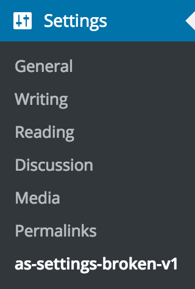
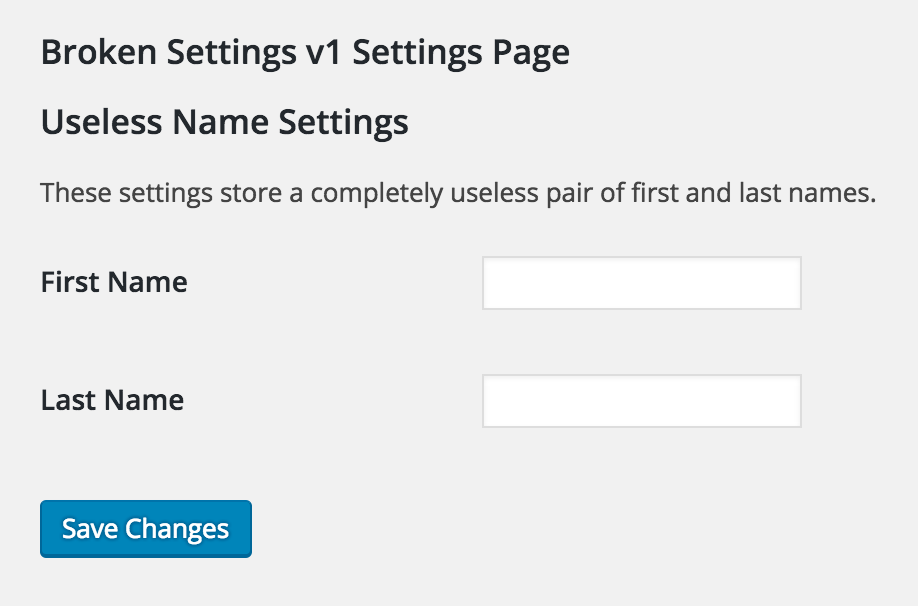

# Example Code: Settings Page - Broken Implementation v1

*__This example code is part of the article: [Using A Config To Write Reusable Code](https://www.alainschlesser.com/using-a-config-to-make-code-reusable/)__*

This is a very naïve "OOP" implementation of a settings page using the WordPress Settings API.

To test this plugin yourself, clone the repository into a `wp-content/plugins` folder of a WordPress installation, and run the command `composer install` from within the plugin's folder to generate the autoloader. You should then be able to activate the plugin and get access to the generated settings page via `Settings` &arr; `as-settings-broken-v1`.

Clicking on this menu entry will bring you to the generated Settings page, which allows you to save two useless settings.

